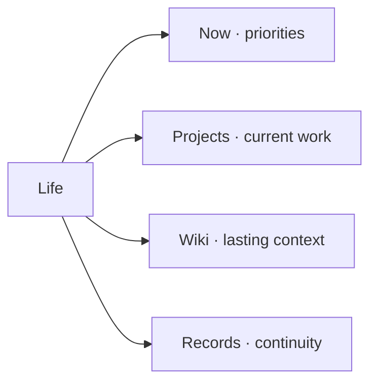

# Life map

[← OS map](../os/knowledge-map.md)

Personal context, current priorities, and the records that help you resume.

| When you need | Open |
|---|---|
| Life-specific instructions | [AGENTS.md](AGENTS.md) |
| Current priorities and constraints | [Now](now.md) |
| Active personal projects | [Projects](projects/readme.md) |
| Personal background | [Background](wiki/owner.md) |
| Daily notes and confirmed decisions | [Records](records/readme.md) |
| Supporting documents | [Documents](documents/readme.md) |
