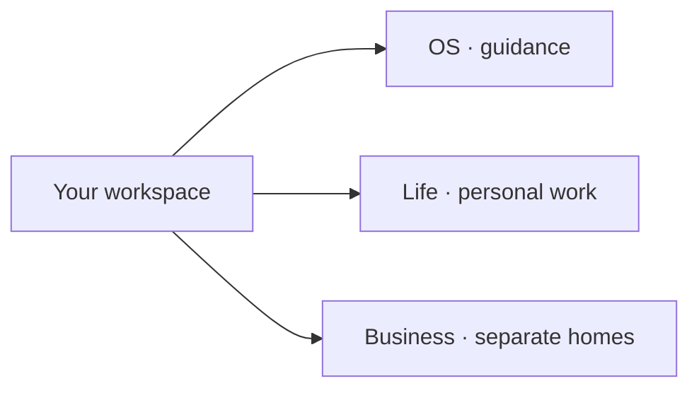

# Knowledge map

Start with the relevant area and load only what the task needs.

## Shared guidance

| When you need | Open |
|---|---|
| Personal context and collaboration preferences | [Agent instructions](AGENTS.md) |
| File locations and Git backups | [Vault map](vault-map.md) |
| Sources, current state, decisions, and daily notes | [Retrieval](retrieval.md) |
| Services and access | [Integrations](integrations.md) |
| Reusable workflows | [Skills](skills/readme.md) |

## Personal and business work

| Area | Start here |
|---|---|
| Personal context and projects | [Life map](../life/knowledge-map.md) |
| Businesses | The relevant business’s local AGENTS.md and map; add actual links when a business exists |
